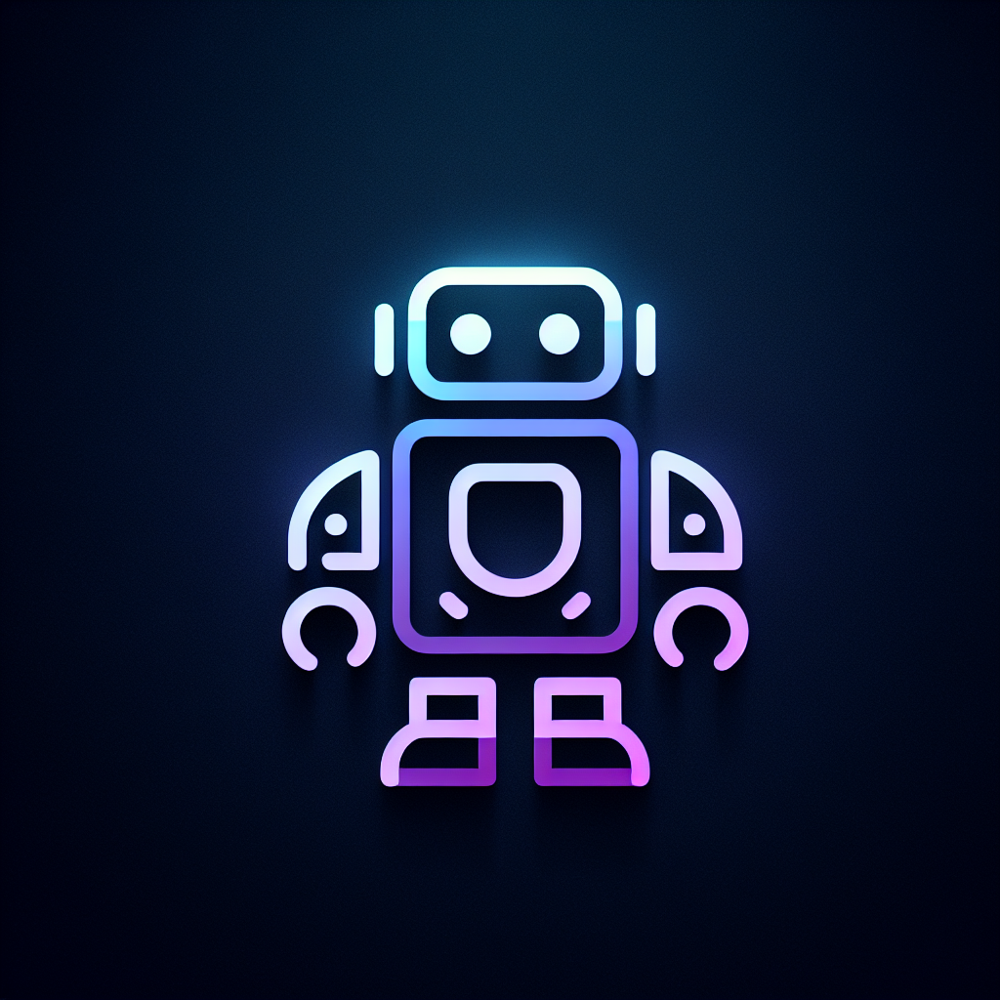

# ArtFlux - Next-Gen Digital Storytelling Platform



**Create, Inspire, and Immerse in the Next-Gen Digital Universe**

ArtFlux is a revolutionary 2D animated and aesthetically immersive storytelling platform that combines the best elements of webtoons, web novels, and Pinterest. Built with modern web technologies, it provides a smooth, highly interactive experience for creators and readers alike.

## 🌟 Features

### Core Functionality
- **📖 Read**: Access to webtoons and novels with immersive reading experience
- **🎨 Create**: Collaborative content creation tools with real-time editing
- **🔍 Explore**: AI-powered discovery of trending content and creators
- **💰 Monetize**: Multiple revenue streams for creators (NFTs, subscriptions, tipping)

### Key Highlights
- **2D Animated Interface**: Smooth transitions and parallax scrolling
- **Dark/Light Mode**: Seamless theme switching with smooth animations
- **Mobile-First Design**: Responsive across all devices
- **AI-Powered Recommendations**: Personalized content discovery
- **Real-Time Collaboration**: Co-writing and collaborative tools
- **Multi-Genre Support**: Fantasy, Sci-Fi, Romance, Slice of Life, Action, Comedy, Drama, Mystery, Thriller, Historical, Horror, Adventure

## 🛠️ Tech Stack

### Frontend
- **React 18** with TypeScript
- **Vite** for fast development and building
- **Tailwind CSS** for styling with custom design system
- **Framer Motion** for smooth animations
- **Wouter** for lightweight routing
- **Radix UI** components for accessible UI elements
- **React Query** for state management and caching

### Backend
- **Express.js** with TypeScript
- **Drizzle ORM** for database operations
- **PostgreSQL** with Neon Database
- **Passport.js** for authentication
- **WebSocket** support for real-time features

### Development Tools
- **TypeScript** for type safety
- **ESBuild** for fast bundling
- **Drizzle Kit** for database migrations
- **PostCSS** and **Autoprefixer** for CSS processing

## 📁 Project Structure

```
ArtFlux Main 2.0/
├── client/                    # Frontend React application
│   ├── src/
│   │   ├── components/        # Reusable UI components
│   │   │   ├── home/         # Home page specific components
│   │   │   └── ui/           # Base UI components (shadcn/ui)
│   │   ├── pages/            # Route components
│   │   ├── layouts/          # Layout components
│   │   ├── hooks/            # Custom React hooks
│   │   ├── lib/              # Utility functions
│   │   └── types/            # TypeScript type definitions
│   └── index.html
├── server/                    # Backend Express application
│   ├── index.ts              # Server entry point
│   ├── routes.ts             # API routes
│   ├── storage.ts         # Storage utilities
│   └── vite.ts              # Vite integration
├── shared/                    # Shared code between client and server
│   └── schema.ts             # Database schema and types
├── attached_assets/           # Design documents and assets
└── Configuration files
```

## 🚀 Getting Started

### Prerequisites
- Node.js 18+ 
- npm or yarn
- PostgreSQL database

### Installation

1. **Clone the repository**
   ```bash
   git clone <repository-url>
   cd "ArtFlux Main 2.0"
   ```

2. **Install dependencies**
   ```bash
   npm install
   ```

3. **Set up environment variables**
   Create a `.env` file in the root directory:
   ```env
   DATABASE_URL=your_postgresql_connection_string
   SESSION_SECRET=your_session_secret
   NODE_ENV=development
   ```

4. **Set up the database**
   ```bash
   npm run db:push
   ```

5. **Start the development server**
   ```bash
   npm run dev
   ```

   The application will be available at `http://localhost:8081`

### Available Scripts

- `npm run dev` - Start development server
- `npm run build` - Build for production
- `npm run start` - Start production server
- `npm run check` - TypeScript type checking
- `npm run db:push` - Push database schema changes

## 🎨 Design System

### Color Palette
- **Primary**: Deep purple, mint, coral, midnight blue
- **Background**: Soft pastel backgrounds
- **Accent**: Bold accent colors for interactive elements

### Typography
- **UI Fonts**: Rounded sans-serif (Nunito, Open Sans)
- **Display Fonts**: Stylized handwritten/comic fonts (Fredoka One)

### Components
Built with **shadcn/ui** components for consistency and accessibility:
- Accordion, Alert Dialog, Avatar, Badge, Button
- Card, Carousel, Dialog, Dropdown Menu
- Form, Input, Navigation Menu, Sheet, Tabs
- And many more...

## 📱 Pages Overview

### 🏠 Home Page
- Hero section with animated logo
- Feature tabs (Read, Create, Explore, Monetize)
- Trending content grid
- AI-powered recommendations carousel
- Genre sections (10-12 genres)
- Creator callout section

### 📚 Read Page
- Library view with grid/list toggle
- Categories: Trending, New, Staff Picks, Community Favorites
- Reader view with scroll/swipe navigation
- Dark/Light mode switch
- Text-to-speech option
- Like, Comment, Share, Save functionality

### 🎨 Create Page
- Co-writing area with real-time collaboration
- Artboards with Pinterest-style pinning
- Video studio for uploads/AI-generated content
- AI script assistant and version history
- Creator dashboard with analytics

### 🔍 Explore Page
- Infinite scroll gallery
- Advanced filters (Genre, Popularity, Date, AI Suggestions)
- Featured creators section
- Hover effects for quick actions

### 💰 Monetize Page
- Multiple earning methods (NFTs, Subscriptions, Tipping)
- Earnings dashboard with graphs
- Payment integration (Stripe/Crypto/PayPal)
- Marketplace preview

## 🗄️ Database Schema

The application uses a comprehensive database schema with the following main entities:

- **Users**: User accounts with creator status and social links
- **Content**: Webtoons, novels, and art with metadata
- **Episodes**: Individual chapters/episodes with content data
- **Interactions**: Likes, bookmarks, and views tracking
- **Comments**: User comments and replies
- **Subscription Tiers**: Creator monetization options

## 🔧 Development

### Code Organization
- **Components**: Reusable UI components in `client/src/components/`
- **Pages**: Route components in `client/src/pages/`
- **API Routes**: Backend routes in `server/routes.ts`
- **Database**: Schema definitions in `shared/schema.ts`
- **Types**: TypeScript definitions in `client/src/types/`

### Styling
- **Tailwind CSS** for utility-first styling
- **CSS Variables** for theming
- **Responsive Design** with mobile-first approach
- **Dark Mode** support with smooth transitions

## 🚀 Deployment

### Production Build
```bash
npm run build
```

### Environment Setup
Ensure the following environment variables are set:
- `DATABASE_URL`: PostgreSQL connection string
- `SESSION_SECRET`: Session encryption secret
- `NODE_ENV`: Set to "production"

## 🤝 Contributing

1. Fork the repository
2. Create a feature branch (`git checkout -b feature/amazing-feature`)
2. Commit your changes (`git commit -m 'Add amazing feature'`)
3. Push to the branch (`git push origin feature/amazing-feature`)
4. Open a Pull Request

## 📄 License

This project is licensed under the MIT License - see the [LICENSE](LICENSE) file for details.

## 👨‍💻 Team

- **Bikshipt Khuntia** - Founder & Developer

## 🗺️ Roadmap

- [ ] AI-Powered Character Builder
- [ ] Moodboard Generator
- [ ] Creator Leaderboards
- [ ] Live Events Section
- [ ] Story Preview Generator
- [ ] Mobile App Development
- [ ] Advanced Analytics Dashboard
- [ ] NFT Marketplace Integration


**ArtFlux** - Where creativity meets technology in the next generation of digital storytelling.
"# Artflux" 
